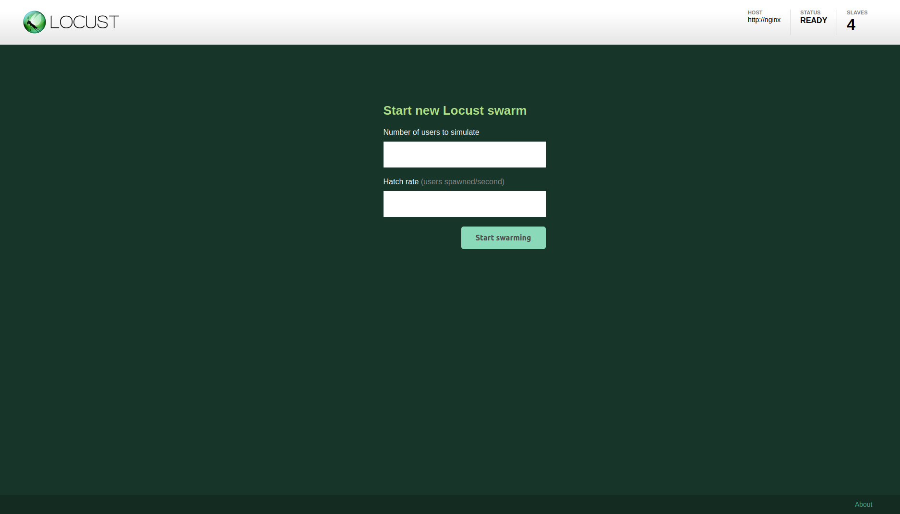
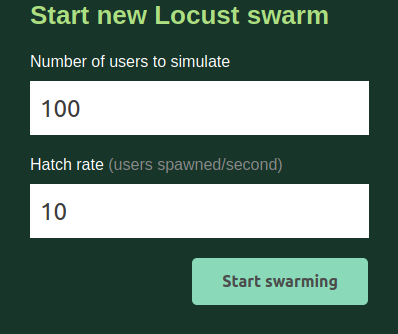
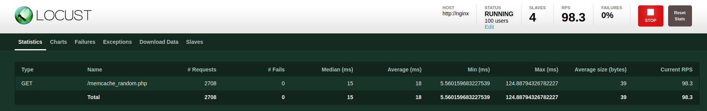
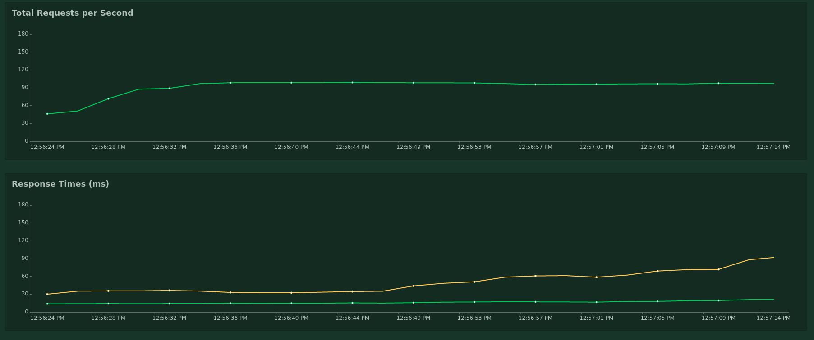
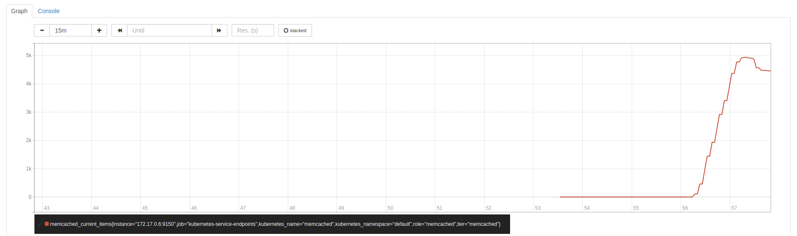

# Load testing HTTP application with [locust](https://locust.io/) on k8s

inspired by : https://github.com/GoogleCloudPlatform/distributed-load-testing-using-kubernetes


You will need a target, here i will be using the [memcache](https://github.com/arnnow/k8s-memcached) & [nginx -
php](https://github.com/arnnow/k8s-nginx-php) k8s deployment

## Building the locust master / slave & services on kubernetes

```bash
{12:06}~k8s-locust-load-testing/env/dev:master ✗ ➭ kubectl apply -k ./
service/locust-master created
deployment.apps/locust-master created
deployment.apps/locust-worker created
```

The targeted URL is defined as a environment variable in the k8s deployment
```bash
{12:07}~/Seafile/Priv/Soft/k8s/k8s-locust-load-testing:master ✗ ➭ grep -ri -A 1 TARGET base
base/locust-master-deployment.yaml:            - name: TARGET_HOST
base/locust-master-deployment.yaml-              value: http://nginx
--
base/locust-worker-deployment.yaml:            - name: TARGET_HOST
base/locust-worker-deployment.yaml-              value: http://nginx
```
Here we are using the service name for our nginx deployment, but you can set it to your url of choosing

You should have a locust deployment/service and pods running  
You should also have a memcache service/pod & deployment as well as nginx & php  

```bash
Every 1,0s: kubectl get pods,rc,svc,deployments,cm,pv,pvc -o wide                                                                                                                            arn: Sun Feb 23 12:18:39 2020

NAME                                 READY   STATUS              RESTARTS   AGE     IP           NODE       NOMINATED NODE   READINESS GATES
pod/locust-master-86786fbd8b-dsdwk   1/1     Running             0          11m     172.17.0.4   minikube   <none>           <none>
pod/locust-worker-77d5dd8fb5-2w7v6   1/1     Running             0          11m     172.17.0.6   minikube   <none>           <none>
pod/locust-worker-77d5dd8fb5-glp5g   1/1     Running             0          11m     172.17.0.8   minikube   <none>           <none>
pod/locust-worker-77d5dd8fb5-wrk86   1/1     Running             0          11m     172.17.0.5   minikube   <none>           <none>
pod/locust-worker-77d5dd8fb5-zswng   1/1     Running             0          11m     172.17.0.7   minikube   <none>           <none>
pod/memcached-545c49f76b-wpzc7       0/2     ContainerCreating   0          6m21s   <none>       minikube   <none>           <none>
pod/nginx-7f7dbdc484-v92pc           0/1     ContainerCreating   0          6m40s   <none>       minikube   <none>           <none>
pod/php-76d6955676-zxdnz             0/1     ContainerCreating   0          6m36s   <none>       minikube   <none>           <none>

NAME                    TYPE           CLUSTER-IP       EXTERNAL-IP   PORT(S)                                        AGE     SELECTOR
service/kubernetes      ClusterIP      10.96.0.1        <none>        443/TCP                                        12m     <none>
service/locust-master   LoadBalancer   10.97.206.75     <pending>     8089:32017/TCP,5557:30910/TCP,5558:31757/TCP   11m     app=locust-master
service/memcached       ClusterIP      10.109.246.183   <none>        11211/TCP                                      6m21s   app=memcached,tier=memcached
service/nginx           LoadBalancer   10.101.156.114   <pending>     80:30822/TCP                                   6m52s   app=nginx,tier=backend
service/php             ClusterIP      10.99.232.68     <none>        9000/TCP                                       6m43s   app=php,tier=backend

NAME                            READY   UP-TO-DATE   AVAILABLE   AGE     CONTAINERS                     IMAGES                                                      SELECTOR
deployment.apps/locust-master   1/1     1            1           11m     locust-master                  arnnow/k8s-locust-load-testing:latest                       app=locust-master
deployment.apps/locust-worker   4/4     4            4           11m     locust-worker                  arnnow/k8s-locust-load-testing:latest                       app=locust-worker
deployment.apps/memcached       0/1     1            0           6m21s   memcached,memcached-exporter   launcher.gcr.io/google/memcached1,prom/memcached-exporter   app=memcached,tier=memcached
deployment.apps/nginx           0/1     1            0           6m40s   nginx                          nginx:latest                                                app=nginx,tier=backend
deployment.apps/php             0/1     1            0           6m36s   php                            arnnow/k8s-nginx-php:latest                                 app=php,tier=backend

NAME                     DATA   AGE
configmap/nginx-config   1      6m54s

NAME                             CAPACITY   ACCESS MODES   RECLAIM POLICY   STATUS   CLAIM                  STORAGECLASS   REASON   AGE     VOLUMEMODE
persistentvolume/php-pv-volume   1Gi        RWO            Retain           Bound    default/php-pv-claim   manual                  6m46s   Filesystem

NAME                                 STATUS   VOLUME          CAPACITY   ACCESS MODES   STORAGECLASS   AGE     VOLUMEMODE
persistentvolumeclaim/php-pv-claim   Bound    php-pv-volume   1Gi        RWO            manual         6m48s   Filesystem
```

We will here target a [php](https://github.com/arnnow/k8s-nginx-php/blob/master/image/files/memcache_random.php) file generating content into memcache  
The locust scenario is defined here [task.py](image/locust-tasks/tasks.py)


Let's Open locust UI:
```
{12:18}~ ➭ minikube service locust-master
|-----------|---------------|-------------|--------------------------------|
| NAMESPACE |     NAME      | TARGET PORT |              URL               |
|-----------|---------------|-------------|--------------------------------|
| default   | locust-master |             | http://192.168.99.114:32017    |
|           |               |             | http://192.168.99.114:30910    |
|           |               |             | http://192.168.99.114:31757    |
|-----------|---------------|-------------|--------------------------------|
* Opening service default/locust-master in default browser...
* Opening service default/locust-master in default browser...
* Opening service default/locust-master in default browser...
```






You can also see data in prometheus  



